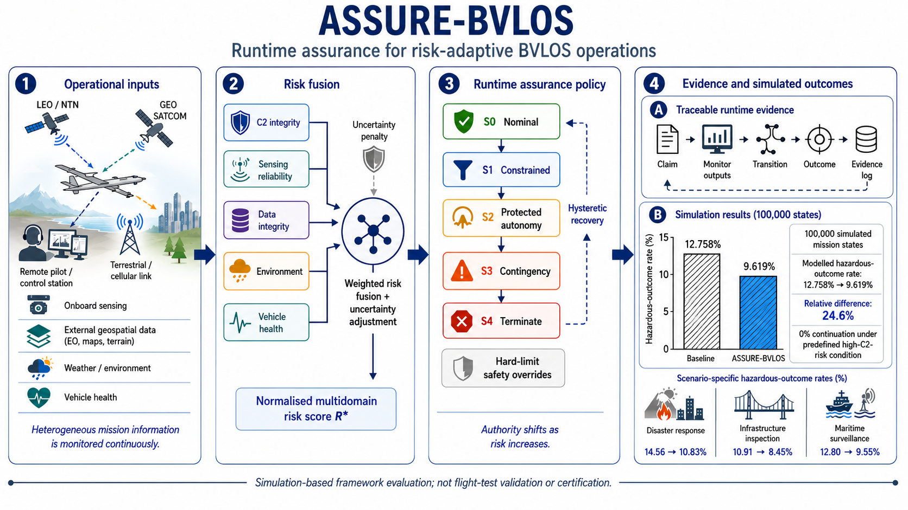
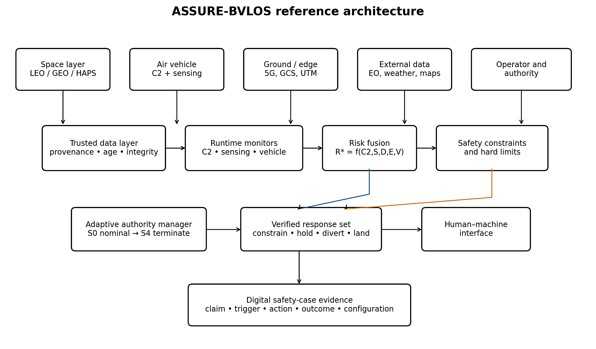
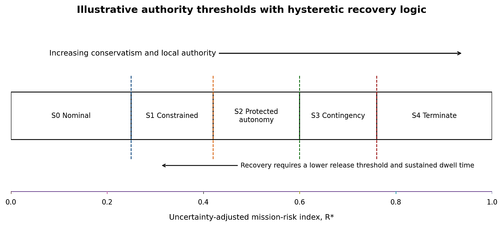
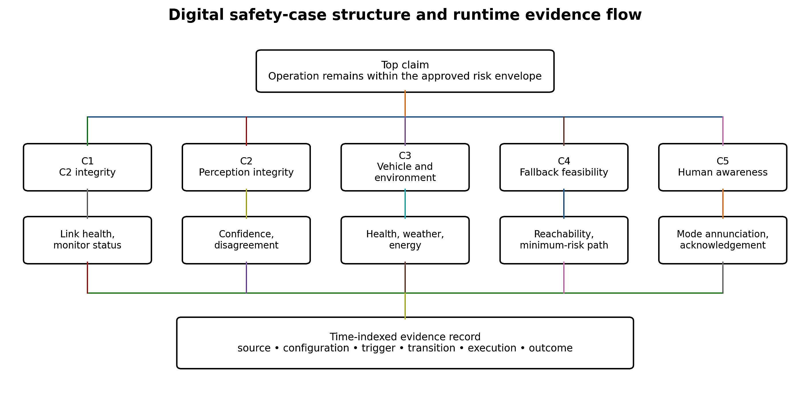
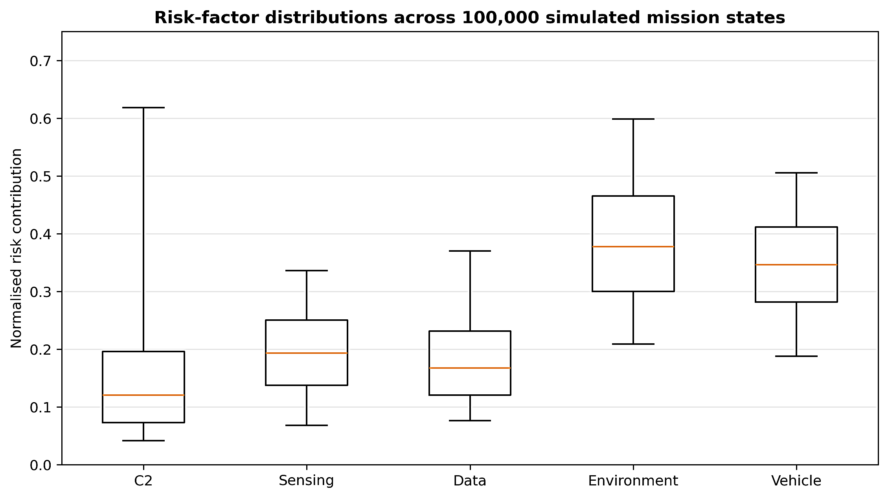
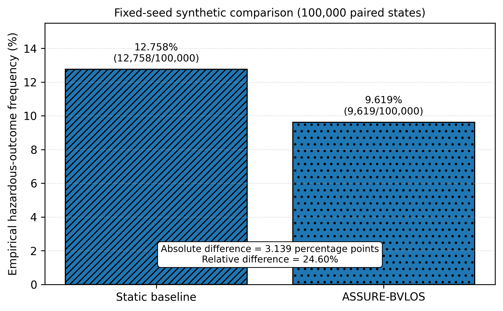
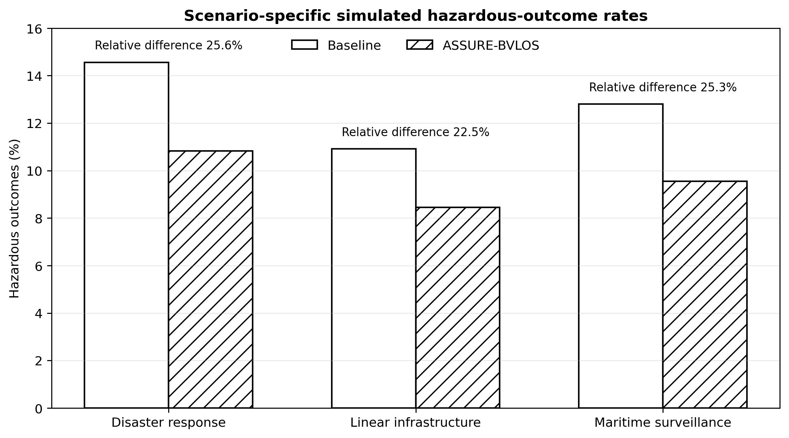

# ASSURE-BVLOS

## Runtime Assurance for Risk-Adaptive Space–Air–Ground Unmanned Aircraft Operations

[](LICENSE)


> A simulation-based runtime-assurance framework for integrating heterogeneous space–air–ground information, quantifying multidomain operational risk, adapting unmanned-aircraft authority, and generating traceable safety evidence for beyond-visual-line-of-sight operations.

---

## Graphical abstract

<p align="center">
  
</p>

The graphical abstract summarises four principal elements of the framework:

1. heterogeneous terrestrial, airborne and satellite-supported operational inputs;
2. uncertainty-aware multidomain risk fusion;
3. adaptive runtime authority with hysteresis and hard-limit overrides; and
4. traceable safety evidence and simulation-based outcome evaluation.

---

## Overview

**ASSURE-BVLOS** is an assurance-oriented computational framework for beyond-visual-line-of-sight (**BVLOS**) unmanned aircraft operations.

The framework evaluates operational conditions continuously across multiple safety-relevant domains and adapts system authority when the assessed risk increases. It combines heterogeneous information from communication, navigation, sensing, environmental, vehicle-health and external geospatial sources.

The framework includes:

- communication, command-and-control and navigation monitoring;
- sensing and perception-confidence assessment;
- environmental and mission-context evaluation;
- vehicle-health monitoring;
- data-age, integrity and provenance assessment;
- uncertainty-aware multidomain risk aggregation;
- hysteretic authority-state transitions;
- predefined hard-limit safety overrides;
- paired baseline and adaptive-policy comparisons; and
- a machine-readable digital safety-case concept.

This repository accompanies the manuscript:

> **ASSURE-BVLOS: Runtime Assurance for Risk-Adaptive Space–Air–Ground Unmanned Aircraft Operations**

The completed repository will contain the software, configuration files, parameter definitions, synthetic mission states, computational outputs and figure-generation materials required to reproduce the simulation results reported in the manuscript.

---

## Repository status

This repository is being prepared as the formal reproducibility package for the associated manuscript.

### Available now

- graphical abstract;
- six manuscript figures;
- BSD 3-Clause licence; and
- repository documentation.

### To be added before release `v1.0.0`

- executable simulation code;
- verified parameter manifest;
- Python dependency files;
- synthetic state-level inputs;
- processed policy outputs;
- robustness and ablation results;
- figure-generation scripts;
- a minimal reproducibility notebook;
- machine-readable citation metadata; and
- Zenodo archival metadata.

The first complete and verified release is planned as **`v1.0.0`**.

That release will be archived on Zenodo and assigned a persistent DOI.

---

## Conceptual framework

ASSURE-BVLOS evaluates five operational-risk domains.

| Domain | Representative variables |
|---|---|
| Communication, command and navigation | Latency, jitter, packet loss, command-link integrity and positioning availability |
| Sensing and perception | Confidence, disagreement, degraded visibility and observation reliability |
| Environment and mission context | Weather, terrain, airspace complexity and mission exposure |
| Vehicle health | Subsystem status, fault indicators and operating margins |
| Data integrity and freshness | Provenance, age, integrity, synchronisation and availability |

The domain-level indicators are combined into a normalised, uncertainty-adjusted risk score.

Runtime authority is then assigned using five ordered states.

| State | Authority mode | General interpretation |
|---|---|---|
| `S0` | Nominal | Normal mission execution |
| `S1` | Constrained | Reduced operational freedom or increased safeguards |
| `S2` | Protected autonomy | Safety-prioritised autonomous behaviour |
| `S3` | Contingency | Contingency procedure, recovery or minimum-risk routing |
| `S4` | Terminate | Immediate termination or a predefined minimum-risk action |

Hysteresis is used to reduce unstable switching between authority states. Recovery therefore requires stronger evidence than escalation.

Hard-limit overrides can bypass the aggregate risk score when predefined critical conditions are detected.

---

## Principal simulation findings

The manuscript reports a paired comparison based on **100,000 simulated mission states**.

### Overall comparison

| Policy or measure | Modelled result |
|---|---:|
| Baseline policy | 12.758% |
| ASSURE-BVLOS policy | 9.619% |
| Absolute difference | 3.139 percentage points |
| Relative difference | 24.6% |

### Mission-specific comparison

| Mission scenario | Baseline | ASSURE-BVLOS |
|---|---:|---:|
| Disaster response | 14.56% | 10.83% |
| Infrastructure inspection | 10.91% | 8.45% |
| Maritime surveillance | 12.80% | 9.55% |

These values are outputs of the synthetic simulation and engineering hazardous-outcome surrogate described in the manuscript.

They are not empirical accident-rate estimates and should not be interpreted as demonstrated real-world safety improvements.

---

## Publication figures

### Figure 1. ASSURE-BVLOS reference architecture

<p align="center">
  
</p>

The reference architecture connects heterogeneous space–air–ground information sources with risk assessment, runtime authority adaptation and evidence generation.

---

### Figure 2. Authority bands and hysteretic recovery logic

<p align="center">
  
</p>

The policy escalates authority restrictions as adjusted risk increases. Hysteretic recovery thresholds reduce rapid state oscillation.

---

### Figure 3. Digital safety-case structure

<p align="center">
  
</p>

The digital safety-case concept links claims, evidence, analysis, runtime transitions and assurance conclusions through a machine-readable evidence repository.

---

### Figure 4. Distributions of normalised risk contributions

<p align="center">
  
</p>

The distributions summarise the simulated contribution of each monitored domain to the multidomain risk model.

---

### Figure 5. Hazardous-outcome rates under the baseline and ASSURE-BVLOS policies

<p align="center">
  
</p>

The paired simulation comparison produced modelled hazardous-outcome rates of 12.758% under the baseline policy and 9.619% under ASSURE-BVLOS.

---

### Figure 6. Scenario-specific hazardous-outcome rates

<p align="center">
  
</p>

The scenario analysis compares the baseline and adaptive policies across disaster-response, infrastructure-inspection and maritime-surveillance missions.

---

## Planned repository structure

The completed reproducibility package will use the following structure:

```text
ASSURE-BVLOS/
├── README.md
├── LICENSE
├── CITATION.cff
├── .zenodo.json
├── .gitignore
├── requirements.txt
├── environment.yml
│
├── ASSURE_BVLOS_Graphical_Abstract.png
├── Figure_1_ASSURE_BVLOS_reference_architecture.png
├── Figure_2_authority_bands_hysteretic_recovery_logic.png
├── Figure_3_digital_safety_case_structure.png
├── Figure_4_distributions_of_normalised_risk_contributions.png
├── Figure_5_hazardous_outcome_rates_baseline_vs_assure_bvlos.png
├── Figure_6_scenario_specific_hazardous_outcome_rates.png
│
├── src/
│   ├── __init__.py
│   ├── config.py
│   ├── distributions.py
│   ├── risk_model.py
│   ├── authority_policy.py
│   ├── outcome_surrogate.py
│   ├── simulation.py
│   ├── robustness.py
│   ├── generate_figures.py
│   └── run_simulation.py
│
├── data/
│   ├── raw/
│   │   └── mission_states_seed_20260717.csv
│   └── processed/
│       └── policy_outcomes_seed_20260717.csv
│
├── results/
│   ├── primary_comparison.csv
│   ├── mission_specific_results.csv
│   ├── authority_state_distribution.csv
│   ├── threshold_sensitivity.csv
│   ├── domain_ablation.csv
│   ├── multi_seed_summary.csv
│   └── coefficient_sensitivity.csv
│
├── notebooks/
│   └── minimal_working_example.ipynb
│
├── docs/
│   ├── EQUATIONS.md
│   ├── PARAMETER_MANIFEST.csv
│   ├── MODEL_ASSUMPTIONS.md
│   └── REPRODUCIBILITY_CHECKLIST.md
│
└── manuscript/
    └── README.md
```

---

## Planned source-code modules

| File | Purpose |
|---|---|
| `config.py` | Random seed, sample size, mission probabilities, thresholds, coefficients and model settings |
| `distributions.py` | Synthetic generation of communication, sensing, environmental, vehicle and data-integrity variables |
| `risk_model.py` | Domain-risk calculation, uncertainty adjustment and aggregate-risk computation |
| `authority_policy.py` | Authority-state assignment, escalation, recovery, hysteresis and hard overrides |
| `outcome_surrogate.py` | Engineering hazardous-outcome surrogate and policy-dependent mitigation |
| `simulation.py` | Paired mission-state simulation and policy comparison |
| `robustness.py` | Threshold sensitivity, domain ablation, multiple-seed and coefficient analyses |
| `generate_figures.py` | Reproduction of computational manuscript figures |
| `run_simulation.py` | Main command-line entry point for the complete workflow |

---

## Planned reproducibility workflow

After the complete executable package is released, the primary analysis will be run using:

```bash
python -m src.run_simulation
```

The workflow will:

1. initialise the documented random seed;
2. generate synthetic mission states;
3. assign mission archetypes and communication-link conditions;
4. calculate the five domain-level risk indicators;
5. compute the uncertainty-adjusted multidomain risk score;
6. apply hard-limit conditions;
7. assign adaptive authority states;
8. evaluate baseline and ASSURE-BVLOS policies using paired mission states;
9. calculate modelled hazardous-outcome frequencies;
10. perform threshold-sensitivity and domain-ablation analyses;
11. export machine-readable result tables; and
12. regenerate the computational figures.

A reduced working example will be supplied in `notebooks/minimal_working_example.ipynb`.

The notebook will use a smaller simulation size so that reviewers can inspect the model logic without running the complete 100,000-state analysis.

---

## Reproducibility targets

Release `v1.0.0` will be designed to reproduce:

- the primary paired policy comparison;
- the baseline hazardous-outcome rate;
- the ASSURE-BVLOS hazardous-outcome rate;
- the absolute and relative policy differences;
- mission-specific comparisons;
- authority-state distributions;
- threshold-sensitivity analyses;
- leave-one-domain-out ablations;
- multidomain risk-contribution distributions; and
- the manuscript’s computational figures.

The release will document:

- random-number generation;
- the primary random seed;
- sample size;
- mission-archetype probabilities;
- communication-link probabilities;
- input distributions;
- threshold definitions;
- risk-domain weights;
- interaction coefficients;
- uncertainty penalties;
- hard-limit conditions;
- outcome-surrogate coefficients;
- mitigation assumptions; and
- rounding conventions.

---

## Data

No personal, confidential, proprietary flight-test or operational accident data are used in the computational study.

The current analysis is based on synthetically generated mission states.

The archived release will provide sufficient synthetic inputs and outputs to verify the reported computational results.

Planned principal files include:

```text
data/raw/mission_states_seed_20260717.csv
data/processed/policy_outcomes_seed_20260717.csv
results/primary_comparison.csv
results/mission_specific_results.csv
results/authority_state_distribution.csv
results/threshold_sensitivity.csv
results/domain_ablation.csv
```

Because the states are synthetic, the repository will not contain personally identifiable information or restricted operational records.

---

## Installation

The installation instructions below will become active after the executable software and dependency files are added.

### Clone the repository

```bash
git clone https://github.com/Nick-Barua/ASSURE-BVLOS.git
cd ASSURE-BVLOS
```

### Option A: Python virtual environment

Create the environment:

```bash
python -m venv .venv
```

Activate it on Windows:

```powershell
.venv\Scripts\activate
```

Activate it on macOS or Linux:

```bash
source .venv/bin/activate
```

Install the dependencies:

```bash
pip install -r requirements.txt
```

### Option B: Conda environment

```bash
conda env create -f environment.yml
conda activate assure-bvlos
```

The dependency versions will be fixed and tested before release `v1.0.0`.

---

## Expected software environment

The verified release is expected to use:

- Python 3.10 or later;
- NumPy;
- pandas;
- SciPy;
- Matplotlib;
- Jupyter;
- PyYAML; and
- pytest.

The final version constraints will be recorded in `requirements.txt` and `environment.yml`.

---

## Validation checks planned for release

Before release `v1.0.0`, the repository will be checked for:

- deterministic reproduction under the primary random seed;
- preservation of paired baseline and adaptive-policy evaluation;
- agreement between exported tables and manuscript values;
- agreement between regenerated and publication figures;
- correct threshold ordering;
- correct hysteretic escalation and recovery behaviour;
- correct hard-limit override behaviour;
- complete parameter documentation;
- complete citation metadata;
- absence of confidential or personally identifiable data; and
- successful execution in a clean Python environment.

---

## Citation

Until the Zenodo DOI becomes available, cite the associated manuscript and this repository.

### Suggested repository citation

```text
Barua, N. (2026). ASSURE-BVLOS: Simulation and reproducibility
package for runtime assurance in risk-adaptive space–air–ground
unmanned aircraft operations. GitHub.
https://github.com/Nick-Barua/ASSURE-BVLOS
```

A machine-readable citation file, `CITATION.cff`, will be added before release `v1.0.0`.

After the release is archived on Zenodo, this section will be updated with the version-specific DOI and the repository concept DOI.

---

## Licence

This repository is distributed under the **BSD 3-Clause License**.

See [LICENSE](LICENSE) for the complete licence text.

The licence permits academic and commercial reuse, modification and redistribution, provided that the copyright and licence notices are retained.

The names of the author and associated organisations may not be used to endorse or promote derived products without prior written permission.

---

## Scientific scope and limitations

This repository supports a computational framework-development study.

The reported results are based on:

- synthetic mission states;
- assumed probability distributions;
- an engineering multidomain risk model;
- predefined authority thresholds;
- an engineering hazardous-outcome surrogate; and
- simulated policy responses.

The results must not be interpreted as:

- flight-test validation;
- certification evidence;
- regulatory acceptance;
- operational approval;
- an empirical accident probability;
- demonstrated safety performance in deployed airspace;
- evidence of compliance with a specific aviation authority; or
- proof that deployment would reduce real-world accident risk.

The framework requires staged verification and validation through:

1. independent software verification;
2. software-in-the-loop testing;
3. hardware-in-the-loop testing;
4. communication and navigation impairment testing;
5. controlled flight trials;
6. operational scenario validation;
7. human-factors assessment;
8. regulatory review; and
9. continued in-service assurance monitoring.

---

## Responsible use

This repository is provided for research, methodological evaluation and reproducibility.

It must not be used as the sole basis for:

- real-world flight-safety decisions;
- autonomous termination decisions;
- regulatory submissions;
- operational deployment;
- aircraft certification;
- command-and-control approval; or
- risk acceptance for safety-critical operations.

Users are responsible for independently verifying all assumptions, equations, thresholds, code, data, regulatory requirements and operational constraints before applying any part of the framework.

---

## Preprint and publication status

The associated work may be available as a preprint before journal publication.

A preprint has not undergone journal peer review and should not be treated as the final peer-reviewed record.

After formal publication, the repository will be updated to include:

- the final article title;
- complete bibliographic details;
- journal name;
- volume and issue;
- article number or page range;
- article DOI; and
- the final Zenodo software DOI.

---

## Contributing and issue reporting

The repository is currently maintained as an author-controlled reproducibility package.

After the first verified release, technical corrections and reproducibility reports may be submitted through GitHub Issues.

When reporting a problem, include:

- operating system;
- Python version;
- installation method;
- dependency versions;
- command executed;
- random seed;
- complete error message; and
- the smallest reproducible example.

Please do not disclose confidential, security-sensitive or operational aviation information in a public issue.

---

## Author

**Nick Barua**

GitHub: [@Nick-Barua](https://github.com/Nick-Barua)

Repository: [Nick-Barua/ASSURE-BVLOS](https://github.com/Nick-Barua/ASSURE-BVLOS)

---

## Release and archival plan

The first complete software release will be tagged **`v1.0.0`**.

Planned release title:

> **ASSURE-BVLOS Reproducibility Package v1.0.0**

The verified release will be archived through Zenodo.

The Zenodo record will contain:

- complete title;
- author metadata;
- release description;
- BSD 3-Clause licence;
- related manuscript information;
- keywords;
- GitHub release archive;
- version-specific DOI; and
- concept DOI covering all repository versions.

---

## Disclaimer

This software and its accompanying materials are supplied without warranty.

The author does not warrant that the framework is suitable for operational aviation use, certification, regulatory approval or safety-critical deployment.

Use of the software is entirely at the user’s own risk and remains subject to all applicable aviation, unmanned-aircraft, communications, privacy, export-control and safety regulations.
